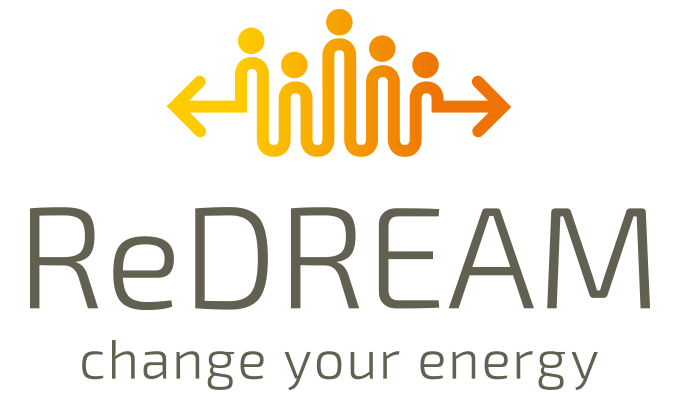

[![MIT License][license-shield]][license-url]
[![LinkedIn][linkedin-shield]][linkedin-url]

<!-- PROJECT LOGO -->
<br />
<div align="center">
    
<h3 align="center">REDREAM - MOBILITY SERVICE</h3>
  <p align="center">
    Web API for the ReDream Mobility Service
    <br />
    <br />
    <a href="https://h2020-redream.utbm.fr/">API main path</a>
    ·
    <a href="https://redream-energy-network.eu/">Project website</a>
  </p>
</div>


<!-- TABLE OF CONTENTS -->
<details>
  <summary>Table of Contents</summary>
  <ol>
    <li>
      <a href="#about-the-project">About The Project</a>
      <ul>
        <li><a href="#built-with">Built With</a></li>
      </ul>
    </li>
    <li>
      <a href="#getting-started">Getting Started</a>
      <ul>
        <li><a href="#prerequisites">Prerequisites</a></li>
        <li><a href="#installation">Installation</a></li>
      </ul>
    </li>
    <li><a href="#usage">Usage</a></li>
    <li><a href="#roadmap">Roadmap</a></li>
    <li><a href="#contributing">Contributing</a></li>
    <li><a href="#license">License</a></li>
    <li><a href="#contact">Contact</a></li>
    <li><a href="#acknowledgments">Acknowledgments</a></li>
  </ol>
</details>


<!-- ABOUT THE PROJECT -->
## About The Project

[![Product Name Screen Shot][product-screenshot]](https://example.com)

The ReDREAM project, funded by EU Horizon 2020, aims to revolutionise the energy market and puts the consumer at the centre.

The mobility service is a web API that allows other ReDream modules to get information about vehicles, routing and energy consumption for travels.

Main features are:
* Provide a database of vehicles based on their energy and size. This database contains a lot of constants needed for other Mobility Service modules.
* Retrieve the energy cost. Electricity price is retrieved from the [Stemy](https://www.stemyenergy.com/) database. Fuel, dies price is retrieved from the [HERE API](https://www.here.com/) database.
* Compute travels route and energy consumption for a given vehicle or using public transport.
* Store and compute KPIs for a user (average energy consumption, average distance, average time, etc.)

Other features will be added in the future.

<p align="right">(<a href="#top">back to top</a>)</p>


### Built With

The modules are built using [Java](https://www.java.com/) 1.8 based on the [Spring](https://spring.io/projects/spring-framework) framework. 

* [Maven](https://maven.apache.org/) is used for project management and building the modules.
* [Spring Boot](https://spring.io/projects/spring-boot) is the main framework used for the modules.
* [Spring Cloud](https://spring.io/projects/spring-cloud/) is used for the microservices architecture.
* [Docker](https://www.docker.com/) is used for the overall deployment.
* [Keycloak](https://www.keycloak.org/) is used for authentication.
* [PostgreSQL](https://www.postgresql.org/) is used for the database.
* [Swagger](https://swagger.io/) is used for the documentation.
* [JUnit](https://junit.org/) is used for the tests.
* [Mockito](https://mockito.org/) is used for the tests.
* [Javadoc](https://javadoc.io/) is used for the documentation.
* [SonarQube](https://www.sonarqube.org/) is used for the code quality.
* [Git](https://git-scm.com/) is used for the version control.

<p align="right">(<a href="#top">back to top</a>)</p>


<!-- GETTING STARTED -->
## Getting Started

In order to use the API, you need to compile the modules and deploy them on a Docker container.

### Prerequisites

The following items should be installed in your system:
* Java 8 or newer (full JDK not a JRE).
* git command line tool (https://help.github.com/articles/set-up-git)
* Your preferred IDE
    * Eclipse with the m2e plugin. Note: when m2e is available, there is an m2 icon in `Help -> About` dialog. If m2e is
      not there, just follow the install process here: https://www.eclipse.org/m2e/
    * [Spring Tools Suite](https://spring.io/tools) (STS)
    * IntelliJ IDEA
    * [VS Code](https://code.visualstudio.com)

### Compilation and push docker images

_Here is an example of possible compilation process. Depending on the IDE you choose, some steps may change_

1) On the command line
    ```
    git clone https://github.com/redream.....git
   ```
2) Inside IntelliJ IDEA
   In the main menu, choose `File -> Open` and select the ReDream-Cloud [pom.xml](pom.xml). Click on the `Open` button.
 
Now the whole projet is opened in the IDE. You can now compile the project. Each module of the project must be compiled. There is a specific maven goal to build and push images on a docker registry.

3) To compile using the command line, move to the root directory of the project. Then execute the following command:
    ```
    mvn clean install package docker:build -DpushImage
    ```
   
<p align="right">(<a href="#top">back to top</a>)</p>

### Installation and running

On the target machine, you need to install the Docker client. Be sure to also install docker-compose.

1) You need to authenticate to the Docker registry.
    ```
    docker login isaratech.registry.jetbrains.space -u username
    ```

2) Move to the root directory of the project and execute the following command:
    ```
    docker-compose up -d
    ```

3) Wait... The application needs few minutes to start.
4) You can now access the application using the following URL:
    ```
    http://localhost:8080/
    ```
5) Tools and other modules are available on the others ports such as 5601, 9411, 9090 and so on...

**If you want to use your own docker registry, you have to edit the configuration in the `pom.xml` file and then in the `docker-compose.yml`. Currently, the docker registry is private, and you need credentials to get the built images.**

<p align="right">(<a href="#top">back to top</a>)</p>

<!-- USAGE EXAMPLES -->
## Usage

### API
Once the application is running, you can use the following endpoints: 

_Please refer to the [Endpoints documentation](resources/Endpoints.md)_

### Tools

Several tools are available on the application. They are part of Spring Cloud framework.

By default, the tools are available on these ports:
* _8761_: Discovery service with web-based UI to monitor the registered services.
* _8888_: Config service with API to retrieve configurations.
* _5432_: PostgreSQL database.
* _9090_: Admin service with web-based UI to manage the application. Metrics and health of services are available.
* _5000_: Logstash service.
* _9200_: Elasticsearch service.
* _5601_: Kibana service. It is a web-based UI to monitor the application. It is also used to visualize the logs.
* _8889_: Keycloack service. Exposes a web-based UI to manage the application authentication.
* _9411_: Zipkin service. It is a web-based UI to monitor the application. It is also used to visualize the traces.
* _9091_: Prometheus service.
* _3000_: Grafana service. It is a web-based UI to monitor the application. It is also used to visualize the metrics.

<p align="right">(<a href="#top">back to top</a>)</p>

<!-- ROADMAP -->
## Roadmap

- [x] Vehicle service
- [x] Energy service
- [x] Routing service
- [x] User service
  - [x] Endpoints to store User KPIs
  - [x] Endpoints to retrieve User KPIs
- [ ] Hybrid vehicles


See the [open issues](mailto:thomas.martinet@utbm.fr) for a full list of proposed features (and known issues).

<p align="right">(<a href="#top">back to top</a>)</p>


<!-- CONTRIBUTING -->
## Contributing

In order to contribute to the project, you need to:

1. Fork the Project
2. Create your Feature Branch (`git checkout -b feature/AmazingFeature`)
3. Commit your Changes (`git commit -m 'Add some AmazingFeature'`)
4. Push to the Branch (`git push origin feature/AmazingFeature`)
5. Open a Pull Request

<p align="right">(<a href="#top">back to top</a>)</p>

<!-- LICENSE -->
## License

Distributed under the MIT License. See `LICENSE` for more information.

<p align="right">(<a href="#top">back to top</a>)</p>


<!-- CONTACT -->
## Contact

Project Link: [https://github.com/hankerspace/ReDREAM](https://github.com/redream...)

<p align="right">(<a href="#top">back to top</a>)</p>


<!-- ACKNOWLEDGMENTS -->
## Acknowledgments

Here are some resources we found useful:

* [Img Shields](https://shields.io)
* [GitHub Pages](https://pages.github.com)
* [Font Awesome](https://fontawesome.com)
* [React Icons](https://react-icons.github.io/react-icons/search)
* [HERE Maps](https://developer.here.com)
* [Google Maps](https://developers.google.com/maps/documentation/javascript/get-api-key)
* [Spring Cloud](https://spring.io/projects/spring-cloud)
* [Netflix OSS](https://oss.netflix.com)
* [Docker](https://www.docker.com)
* [Docker Compose](https://docs.docker.com/compose/overview/)
* [Docker Registry](https://hub.docker.com)
* [Best Readme Template](https://github.com/othneildrew/Best-README-Template)
* 


<p align="right">(<a href="#top">back to top</a>)</p>


<!-- MARKDOWN LINKS & IMAGES -->
<!-- https://www.markdownguide.org/basic-syntax/#reference-style-links -->
[license-shield]: https://img.shields.io/github/license/github_username/repo_name.svg?style=for-the-badge
[license-url]: https://github.com/hankerspace/ReDREAM/blob/main/LICENSE
[linkedin-shield]: https://img.shields.io/badge/-LinkedIn-black.svg?style=for-the-badge&logo=linkedin&colorB=555
[linkedin-url]: https://www.linkedin.com/company/redream-energy/
[product-screenshot]: resources/images/ReDream2.png